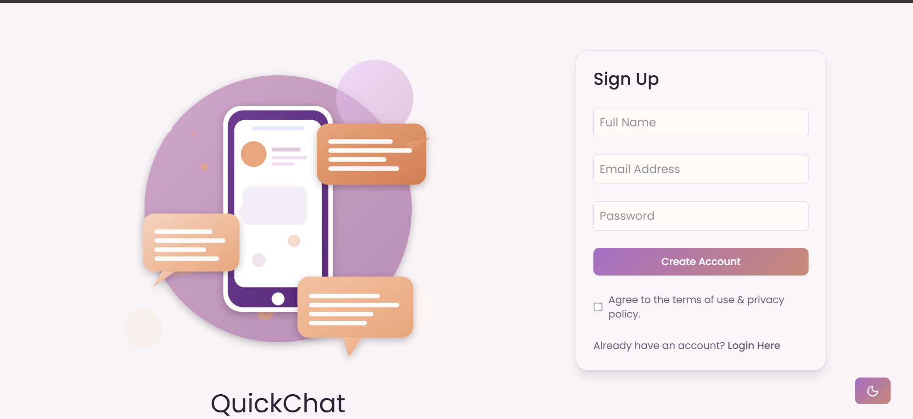

# 💬 QuickChat — Real-Time Chat Application

A full-stack **real-time chat platform** built using **React**, **Node.js**, **Express**, **MongoDB**, and **Socket.io**, featuring instant messaging, media uploads via **Cloudinary**, and a fully responsive modern UI.

🌐 **Live Demo:** [https://chatapp-frontend.vercel.app](https://chat-app-neon-ten-95.vercel.app)  
🖥️ **Backend:** [https://chatapp-backend-sd9y.onrender.com](https://chatapp-backend-sd9y.onrender.com)

---

## 🚀 Features

- 🔐 **User Authentication**
  - Secure login/signup with JWT tokens.
  - Auto session handling using localStorage.

- 💬 **Real-Time Messaging**
  - Built with **Socket.io** for instant, bi-directional communication.
  - Live online/offline user tracking.

- 🖼️ **Media Sharing**
  - Upload and share images or profile pictures via **Cloudinary** integration.

- 📱 **Fully Responsive Design**
  - Clean, adaptive UI that works flawlessly across **mobile**, **tablet**, and **desktop** screens.
  - Modern aesthetic with Tailwind CSS utilities.

- 🧑‍🤝‍🧑 **Active User Presence**
  - Real-time updates on active users.
  - Automatic status change when logging out or disconnecting.

- ⚙️ **Scalable and Reliable**
  - REST APIs with **Express.js** and **MongoDB** for data persistence.
  - Deployed backend on **Render** and frontend on **Vercel**.

---

## 🧩 Tech Stack

| Layer | Technologies |
|-------|---------------|
| **Frontend** | React, Vite, TailwindCSS, Axios, React Hot Toast |
| **Backend** | Node.js, Express.js, Socket.io |
| **Database** | MongoDB (Mongoose ORM) |
| **Media Storage** | Cloudinary |
| **Deployment** | Render (Backend), Vercel (Frontend) |

---

## 🖼️ Screenshots

### 🔐 Login Page

### 💬 Chat Interface

### 📱 Mobile Responsive Layout

## 🏆 Key Highlights

Focused on real-time UX and responsive mobile-first design.
Integrated Cloudinary for seamless image uploads.
Utilized MongoDB for robust and scalable data storage.
Designed clean reusable React components and state management.
Optimized for deployment on free-tier cloud services.

## 👩‍💻 Developer

Prachi Kedia
🎓 2nd-year Mechanical Engineering, NIT Durgapur
💡 Web Developer | DSA Enthusiast

This project marks the beginning of my journey in full-stack development. I aim to build more advanced and scalable applications, focusing on clean architecture, performance, and user experience. QuickChat serves as a strong foundation for upcoming projects in my portfolio.

⭐ If you like this project, give it a star on GitHub!
